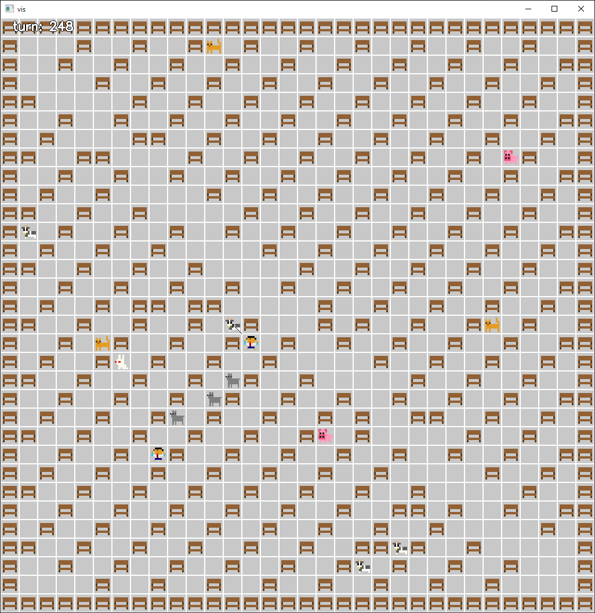

柵設置 → 犬以外捕獲 → 犬捕獲

スコアは 3.9B くらい

* 柵設置
  * iehn さんが最初に上げていた gif の丸パクリ
  * 空いた人間に最も近くのタスクを貪欲に割り当てるだけ
    * タスクは (開始位置, コマンド列) から得られる一連の action
  * ちゃんと計算すればターンを短縮できるかも
* 犬以外捕獲
  * 柵設置より優先度高
    * 柵設置中に捕まえられる状況が発生したら即座に捕獲するようになっている
  * 柵の設置が終わって暇な人間には最も近くにいるペットを捕獲するタスクを割り当てる
    * 逃げ足の速いブタやウサギなどは人員をバトンタッチした方がよいこともありそう
    * 入り口をすぐに塞いでしまうとスコアが減ってしまう　いい塩梅で攻める
* 犬捕獲
  * 二手に分かれると犬どもが二箇所を往復するようになるので捕獲できる
  * 現状、一人に尊い犠牲となってもらっている

---

以下のようにすれば犠牲なしを実現できる

* 犠牲なし
* ペット捕獲タスクをターン毎に再割当て

で 4.6G くらい

いくつかのケースで間に合わず取りこぼしが発生しているので、これを解消すれば 4.8G くらいまでは行きそう…

---

seq task 終了前に別の人間が柵を設置して到達不可になるとバグる
-> fixed

dogkill が偶然全ての犬を捕獲した後に発動するとバグる
-> fixed

各 human の行動のたびに状態の update を行うべき（高々 3000 回)
-> fixed

牛の殺し方を工夫する必要がある

